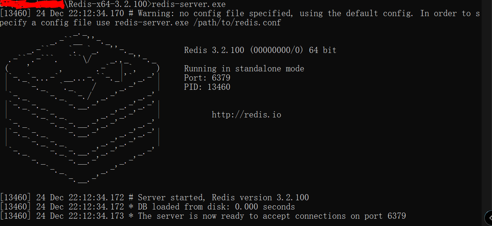
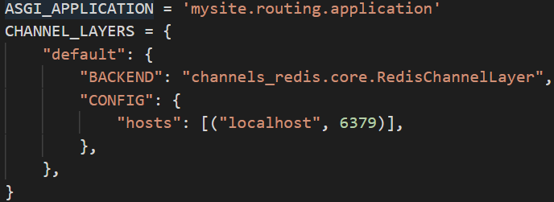
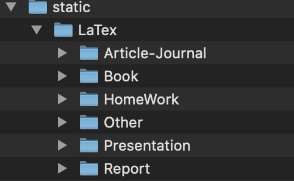
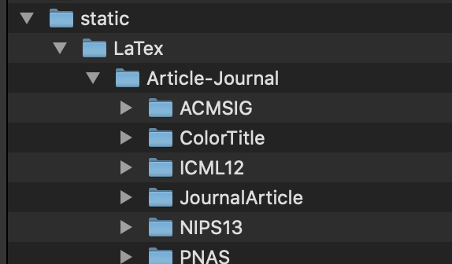
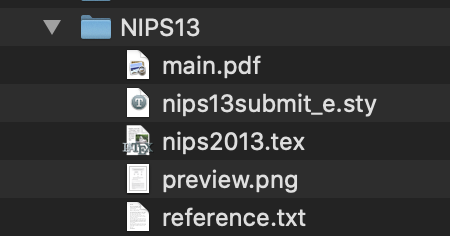

# CS309-OOAD-SUSTex
## Environment
### Backend 
python 3.6 above is required.

django version is 2.2.7

channels version is 2.3.1

channels_redis version is 2.4.1

redis version is 5.0.7

requests version is  2.22.0

django-cors-headers version is 3.2.0 

Moreover, the requirements.txt is modified to satisfy the environment. To install the dependency, please run

```
pip install -r requirements.txt
```

### Redis

- Download or Install 
You can download the redis from this website https://redis.io/download, or here https://github.com/antirez/redis; 
1. Download
If you are on macOS, you can Use Homebrew to install 
```
brew install redis

brew services start redis
```
2. Open & Test Redis
If you are on Windows, you have to start the sever manually by changing the directory and get started. 


Moreover, you can find help from here: https://stackoverflow.com/questions/31769097/cant-bind-tcp-listener-6379-using-redis-on-windows

Then if your redis is working properly, you can open another terminal or command prompt in current working folder and type:
```
redis-cli ping
```
You should get the following result:
```
pong

```
3. Layers in Django
After you install and get started redis running, you could have to set the setting correct layers in django in Django/mysite/setting.py, by following the default setting from channels official website as following:


### Frontend

Node.js and yarn is required (make sure Node.js and yarn are installed on your system.)

Please run (after you cd into React folder)

``` 
yarn install 
yarn build
yarn start
```
Then, for the open browser, please type http://localhost:3000/#/templates to get started. 

## To add a template into backend static folder



The static folder is inside the Django folder, and inside each kind, there are several templates.



For each templates, there are 3 required file: the first one is a tex one, which is the main tex file for the template; the second one is a text one, which is the original template url ; the third one is the preview pdf file. For those projects with photos, the resolution should be 1350×1900, otherwise the wired situation will happen.




